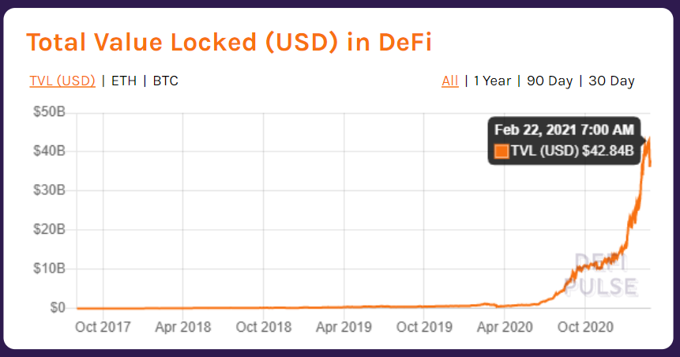

# The problem 

Cryptocurrency and Decentralized Finance (DeFi) offer a way to start with a new system, circumventing the difficulties faced in changing the finance industry. While crypto has attracted billions in investments, decentralized financial services are lagging. When it comes to investment in cryptocurrency, crypto investors can buy and sell, but that’s it. The cryptocurrency itself cannot be invested in the same way fiat currency can be. Initial attempts to create peer-to-peer lending and asset tokenization so far have proven partial and unreliable, so investors have extremely limited options when it comes to an investment of their crypto assets. The potential is enormous to provide financial services in crypto, the same way they are offered in fiat currency.

First, we must be clear about what DeFi is. DeFi, in its ideal form, exhibits four properties.

*   First, non-custodial financial services allow participants to exert full control over their funds at any point in time.
*   Second, the permissionless nature of DeFi allows anyone to interact with financial services without being able to be censored or blocked access by a third party.
*   Third, DeFi is openly auditable, which means that anyone can audit the state of protocols-e.g., that they are fully collateralized/healthy.
*   Fourth, financial services can be arbitrarily composed such that new financial products and services can be created similar to how one can conceive new Lego models based on a few basic building blocks.

DeFi has grown rapidly, going from around 600m USD in total value locked (TVL) at the start of 2020 to over 42bnUSD as of February 2021, with the most capitalized use cases being collateralized lending, constituting c.48% of the TVL, and decentralized exchange (DEXs), constituting c.34% of the TVL as of January 2021 [2]. In turn, this rise led to the 24 hour volume on a decentralized crypto asset exchange [3], overtaking that of a major centralized crypto-asset exchange [4] for the first time [5].

_(Total value locked in Defi - Defipulse)_

Yet, as with any nascent technology, the evolution of DeFi is not without its risks. In the last year alone, DeFi has experienced more than 20 major protocol exploits, resulting in a loss of funds amounting to over 130m USD [6]. An apparent willingness of market participants to take large financial risks coupled with the possibility of any actor writing unaudited and even malicious smart contracts—precisely due to the decentralized nature of such technologies—renders the risks particularly acute. Moreover, due in part to the emergent complexity of smart contracts once composed together, there are even several instances (e.g., [7], [8], [9], [10], [11]) of audited protocols being exploited, rendering the audit process an imperfect defense against exploits.

Moreover, at a technical level, the blockchains underlying DeFi are facing significant challenges. Blockchain transaction fees have risen considerably during periods of congestion, with the fees for relatively simple smart contract operations running into the hundreds of dollars. Rising transaction costs price out small transactions, in turn restricting the set of transaction types for which the layer-one blockchain can be used.

[_(https://bitinfocharts.com/comparison/ethereum-transactionfees.html)_](https://bitinfocharts.com/comparison/ethereum-transactionfees.html))

In conclusion, since over 90% of DeFi projects are based on Ethereum blockchain, we will consider the challenges for Ethereum challenges as DeFi challenges:

**Scalability**

Another big problem with DeFi projects is the scalability of the host blockchain. Two major problems arise from the scalability problem:

*   Transactions take a long time to be confirmed
*   The transaction is extremely expensive at times of congestion

Ethereum at full capacity can process about 13 transactions per second, while centralized counterparts can process thousands and thousands of transactions. And Ethereum sing

**Smart Contract Problems**

Smart contract vulnerability is a major source of issues for many DeFi projects. If there is the slightest flaw in the code of a smart contract, it can lead to loss of funds.

**Low Interoperability**

There are different types of blockchains such as Bitcoin, Ethereum, Binance Smart Chain, each with its DeFi ecosystem and community. Interoperability enables DeFi platforms, tools, DApps, and smart contracts on different blockchains to interact with each other. Until this becomes simpler, many projects are siloed.

**Lack of Insurance**

Insurance protects investors in the event of hacks or other fraudulent activities. Insurance plays a very important role in centralized finance while it is much rarer in DeFi.