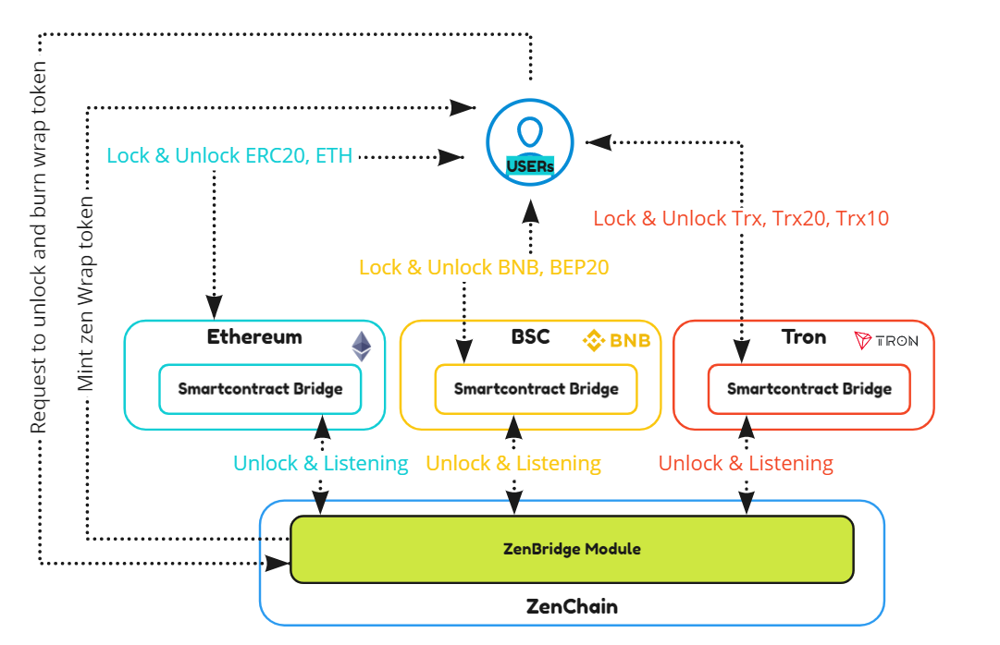
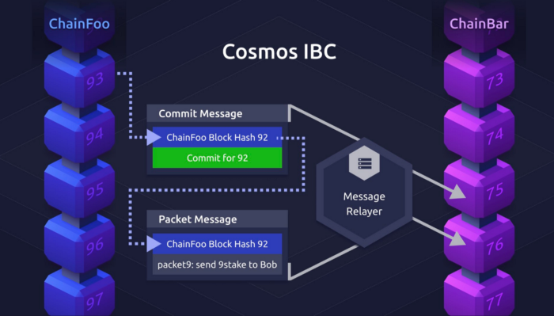

## Cross-chain solutions {#cross-chain-solutions}

ZenChain is two types of solution to allow token transfer across exits public blockchain:

*   Bridge solution: Two way connect between ZenChain and Etherum, Polkadot, Binance SmartChain, Tron .. and more chain with ZenBridge module
*   IBC solution: Two-way connect between ZenChain and Cosmos family blockchain using Inter-blockchain Communication protocols.

### Bridge from Etherum, Polkadot, Binance smart chain, Tron, and more ... {#bridge-from-etherum-polkadot-binance-smart-chain-tron-and-more}

ZenBridge is ZenChain &lt;-&gt; Etherum, Polkadot, Binance smart chain, Tron, and more chain ... bridge designed to run on the ZenChain focused on maximum design simplicity and efficiency. The bridge can transfer tokens (ETH, ERC20, DOT, TRX, TRC20, BEP20 ... ) two-way between Ethereum, Polkadot, Binance smart chain, Tron ... to a ZenChain.

#### The design of Gravity Bridge {#the-design-of-gravity-bridge}

Validators are fully trusted to manage the bridge. Validator powers and votes are replicated on the Ethereum, Polkadot, Tron, Binance smart chain side so trust in bridge assets depends entirely on trust in the validator set of the peg zone chain. This has known problems where the assets in the bridge exceed the market cap of the native token. We accept these known issues in exchange for the dramatic design simplification combined with acceptable decentralization this design provides.

The ZenBridge Ethereum, Polkadot, Tron, Binance smart chain contract only supports ERC20, TRC20, BEP20 transfers and not arbitrary data. This helps keep the contract simple enough to optimize heavily and reach production quality quickly.

Peg zone validators must maintain a trusted Ethereum, Polkadot, Tron, Binance smart chain node. This removes all trust and game theory implications that usually arise from independent relayers, once again dramatically simplifying the design.

On a high level, the transfer flow for transferring a token to the is as follows:

*   The user sends the token (ERC-20, TRX20, BEP20, DOT) to the Zen Bridge Contract was deployed on each chain, emitting a LogLock event.
*   A ZenBridge relayer listening to the event creates and signs a Tendermint transaction encoding this information which is then broadcasted to the Zen Chain.
*   The nodes of the Zen Chain verify the validity of the transaction.
*   New tokens representing the ERC-20, TRX20, BEP20, DOT are minted in the bank module of ZenChain

Thereafter, the ERC-20 can be used on Zen Chain&#039;s EVM as well as in the Cosmos-SDK-based application logic of the Zen Chain.

_(Bridge flow with ZenBridge solution)_

### Inter-blockchain Communication Protocol (IBC) {#inter-blockchain-communication-protocol-ibc}

In the future, the zen chain will support cross-chain transfers using[Tendermint IBC](https://tendermint.com/ibc/).

