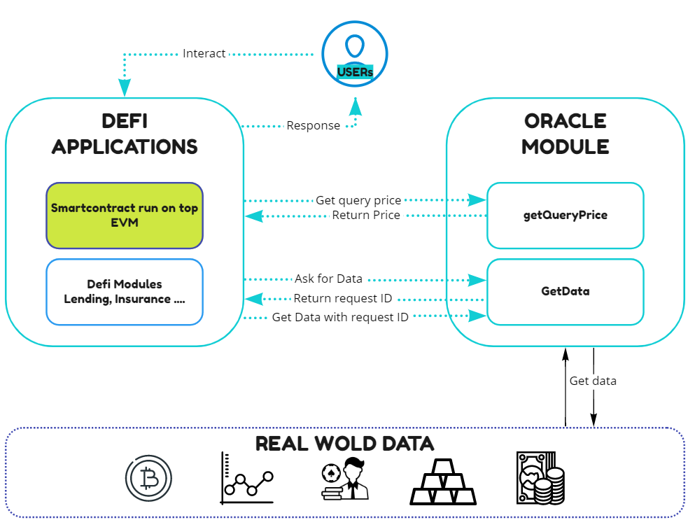

## Decentralized oracles 

All blockchain platforms that operate and execute code trust in smart contracts suffer from the same centralizing issues that arise when needing to use external data points. Many decentralized systems rely on being able to perform basic tasks and computations that require external data feed such as asset price, inter-chain communications, real-world events, and external web API interactions.

Smart contracts cannot access data by themselves – there is no simple and intuitive query interface for decentralized applications to receive real-world data. Until Decentralized applications can interface real-world external data inputs into simple function calls, there will be significant barriers in the adoption of the technology and the accessibility for developers to realize new applications. Existing data availability solutions for blockchain smart contracts either depend on highly critical central points of failure or are subject to asynchronous interactions, which cause delays and complicate the smart contract logic.

An oracle is a mechanism for importing off-chain data into the blockchain virtual machine so that it is readable by smart contracts. This includes, for instance, prices of off-chain assets, such as ETH/USD, or off-chain information needed to verify outcomes of prediction markets, and is relied upon by various Defi protocols (e.g. [35], [36], [37], [38], [39]). Such data is not natively accessible on-chain.

_(ZenChain Oraclize solution - Bring off-chain data to on-chain)_