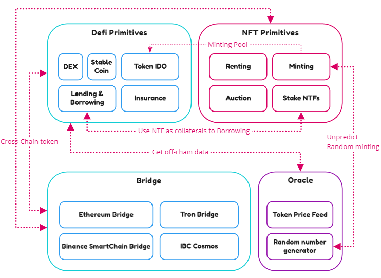
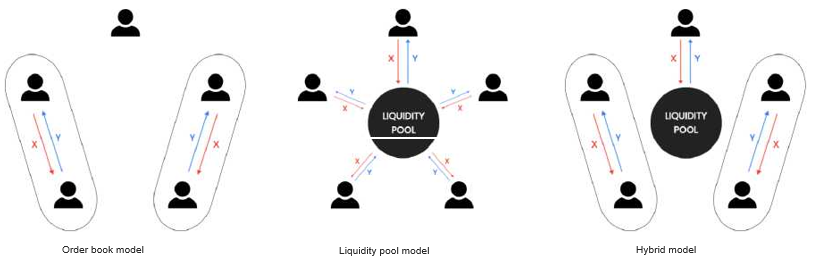

## DeFi primitives built-in {#defi-primitives-built-in}

The initial Defi primitives set includes:

*   Decentralized exchanges
*   Stable coin
*   Lending
*   Insurance
*   Token IDO pool

_(ZenChain components struct)_
### Decentralized exchanges {#decentralized-exchanges}

Based on the mechanism for price discovery, DEXs come in different variants, such as order book DEXs (including individual [60], [57] and batch settlement [61], [62]) and automated market makers (AMMs) (e.g., [63], [64], [65]).

The module features an AMM model combined with order books, multi-block batches, and limit orders to bring high-quality liquidity to the ZenChain

We propose a Hybrid Exchange model that combines a batch-based order book matching algorithm with an AMM-based methodology such that:

*   Orders are accumulated in the order book
*   At every batch execution height, the order book is processed using a matching engine
*   The liquidity pool participates in the matching process using the equivalent swap price model

Also, the proposed model

*   Permits limit orders that stay in the order book until they are filled or canceled. Indeed, they can remain open over multiple batches
*   Allows partial filling of orders in the case where order price is equal to swap price.

**Batch Execution**

To address the issues related to order execution, it is proposed to use a Batch Execution method-ology. This follows a proposal outlined by (Pourpouneh, Nielsen, and Ross 2020), which is called &quot;batch auction”

An alternative market solution is a DEX with discrete clearing as opposed to continuous clear-ing - a so-called &quot;batch auction.” The frequent batch auction provides all buyers and sellers with the same trading opportunities by removing the randomness from the speed of processing the orders. Instead of focusing on getting first in line to trade at a given price, buyers and sellers are allowed to submit numerous contingent bids and ask that all enter the same double auction within a given time window. The batch auction has been put forward to address the front-running problem caused by High-Frequency Trading (HFT) on traditional financial exchanges (Budish et al. 2014). In crypto, the batch auction can solve some problems. The front running problem is addressed directly as all bids and asks are treated equally. As each batch can include as many bids and asks as needed, performance limitations can be captured by the time window.

In batch execution, orders are accumulated in a liquidity pool for a predefined period, which can be one or more blocks in length. Orders are then added to the pool and executed at the end of the batch.

In our model, there are two key features:

• Unexecuted orders from the batch remain in the order book to be executed in a future batch

• The batch period can be changed to reflect market conditions. For example, the batch period can be lengthened when there exists a significant price change due to high order volumes. An extended batch period invites more traders to participate in price discovery, which results in a more balanced and stable process. This is similar to the &quot;dynamic closing” or &quot;extended bidding” models used in many online auction platforms (&quot;Auction Terminology” 2020).

As (Pourpouneh, Nielsen, and Ross 2020) mentions, for a DEX, batch execution prevents front-running and collusion between miners/validators and traders, resulting in a fairer trading environment for all.

**Order Matching Rules**

The model allows fractional and full matching of orders based on the following criteria:

• Swap orders from X to Y

- If order price &gt; swap price then the order must be fully matched

- If order price == swap price then the order can be fully/fractionally matched

- If order price &lt; swap price then the order must not be matched at all

• Swap orders from Y to X

- If order price &lt; swap price then the order must be fully matched

- If order price == swap price then the order can be fully/fractionally matched

- If order price &gt; swap price then the order must not be matched at all

The liquidity pool contributes liquidity to order matching through the Equivalent Swap Price Model.

**Equivalent Swap Price Model**

Constant Product Equation: RxRy = k where Rx and Ry represent the reserve amount of different two tokens (x and y) and k is constant such that k &gt; 0.

This product remains constant during the token swap process such that for time t+1.

From this, it is observed that when a user places an order of tokens

Where the effective swap price ps is the swap price. Rearranging this gives

However, the new pool price pp is

The implication of the above equations implies that the post-swap pool price is different from the swap price. This price inconsistency causes several effects:

*   Repeated price swing attracts more arbitrage opportunities than what AMM needs for real-time price discovery
*   Excessive arbitrage opportunities in AMM will cause more loss to pool investors and traders

_(Inefficient Price Discovery By Constant Product Model)_

The Constant Product Model results in differences between the Swap Price and Pool price after execution. This creates an issue when using an order book with the liquidity pool since there will be a difference between the swap price in the order book and the price offered by the liquidity pool. To address this, the swap price calculation is redefined, so that swap price and post-swap pool price are equivalent:

Solving the above equation for SwapPrice ps yields

Compared to the Constant Product Model, the Equivalent Swap Price Model reduces the arbitrage opportunity because the pool price lands precisely on the last swap price.

_(Efficient Price Discovery By Equivalent Swap PriceModel)_

However, it should be noted that the result of this price equivalence is that the Constant Product Formula does not hold. This means that the liquidity pool balance is path-dependent. This model decides the number of orders provided by the liquidity pool for a given swap price

_(Demand and Supply)_

### Lending and borrowing {#lending-and-borrowing}

Lending and borrowing of on-chain assets are facilitated through protocols for loanable funds (PLFs) [76], [77], which refer to DeFi lending protocols that establish distributed ledger-based markets for loanable funds of crypto assets. In the context of a PLF, a market refers to the total supplied and total borrowed amounts of a token, where the available (i.e., non-borrowed) deposits make up a market&#039;s liquidity. Unlike peer-to-peer lending, where funds are directly lent between individual agents, in a PLF, deposits for a given token market are pooled together in a smart contract. An agent may directly borrow against the smart contract reserves, assuming the market for the token is sufficiently liquid.

The cost of borrowing in a PLF is given by an interest rate charged to the borrower, which is determined by a market&#039;s underlying interest rate model. These interest rate models tend to reflect the notion that as liquidity becomes scarcer, a higher interest rate should encourage current borrowers to repay their debts while incentivizing holders of excess deposits to supply these.

In exchange for depositing funds, a depositor receives a derivative token reflecting his share of the total supplied funds in a market. As interest paid by borrowers is generally retained by the smart contract, the relative share of total funds in a market of a derivative token holder will increase over time. Accrued interest in a market is thereby paid out to the market&#039;s depositors as compensation for providing liquidity, while a reserve fraction is retained from the paid out interest by the protocol to protect against periods of illiquidity [80] and market stress.

For lending and borrowing running we using:

#### **Interest Index:** {#interest-index}

The history of each interest rate, for each money market, is captured by an Interest Rate Index, which is calculated each time an interest rate changes, resulting from lending, borrowing, repaying, liquidity assets.

Each time a transaction occurs, the Interest Rate Index for the asset is updated to compound the interest since the prior index, using the interest for the period, denominated by r * t, calculated using a per-block interest rate:

#### **Interest Rate Logics** {#interest-rate-logics}

**Borrowing interest**

Interest rates for borrowing are set algorithmically based on supply and demand.

As Demand increases, the interest rates go up, as Supply increases, the interest rates go down.

As lending increases, the interest rates go down. The equations that we use for interest rate are similar to the following:

**_Example:_**

_When no one borrows: Borrows Interest = MinRate_

_When half of the lending pool is borrowed: Borrow Interest = MinRate + AdjustRate/2/._

_When all of the lending pool is borrowed (Bull market): Borrow Interest will so high = MinRate + AdjustRate_

**Lending interest**

In basic, all borrowing interest generated by this protocol will transfer to lending user with a small fee for reserve in protocols (first, we set it to 0.5%)

**_Example:_**

_When no one borrows: Lending Interest = 0_

_When half of the lending pool is borrowed: Lending Interest = BorrowInterest*95%/2_

_When all of the lending pool is borrowed (Bull market): Lending Interest will so high = BorrowInterest * 95%._

### Stable coin {#stable-coin}

Non-custodial stable coins are crypto-assets that aim to be price stable relative to a target currency, commonly the USD and seek to achieve this via additional economic mechanisms. The core components of a non-custodial stablecoin are as follows [40].

**• Collateral.** This is the store of primary value for a stable coin. Collateral can be zETH, zBTC, or ZEN token.

**• Agents.** Agents form at least two roles in a non-custodial stable coin: (i) risk absorption, for instance by providing collateral that is intended to absorb price risk, and (ii) stable coin users.

**• Governance.** A mechanism and set of parameters that governs the protocol as a whole (either performed by agents or algorithmically).

**• Issuance.** A mechanism to control the issuance of stable-coins against or using the collateral (either performed by agents or algorithmically).

**• Oracles.** A mechanism to import data external to the blockchain onto the blockchain, such as price-feeds.

### Token IDO {#token-ido}

ZenChain Token IDO is a decentralized incubator that helps promising projects achieve their full potential by leveraging the investment power and buzz making potential of our community.

We aim to democratize access to investment opportunities that were previously available only to well-heeled investors and venture funds, opening up the closed ecosystem of early-stage crypto project investments to everybody.

The platform allows cryptocurrency projects to raise funds by setting up a swap pool based on a fixed purchase rate for tokens. These so-called “Fixed Swap Pools” have many advantages for token sale investors over traditional fundraising models like ICOs, IEOs, and IDOs (Initial DEX Offerings). Fixed Swap Pools will maintain the token price throughout the sale until the initial supply is bought.

With ZenChain Token IDO, decentralized projects will be able to raise and exchange capital cheap and fast. Users will be able to participate in a secure and compliant environment and to use assets that go way beyond the current ERC20 standard.