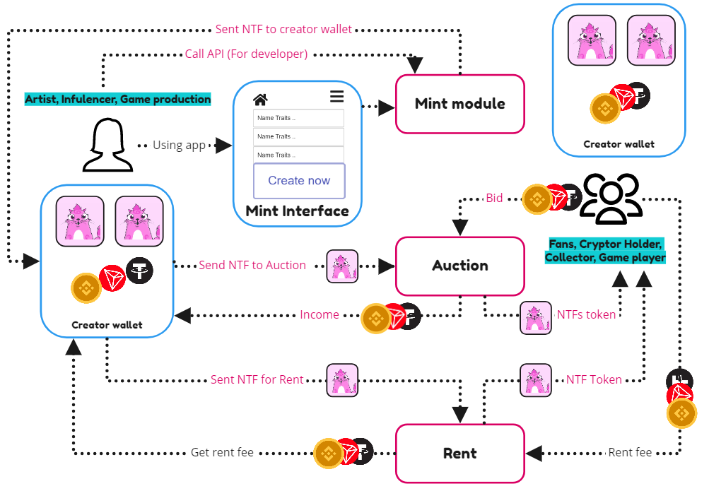

## Non-fungible Token applications 

### Minting 

With ZenChain, artist, influencer, game production, defi dapp can easily make their NTFs with blade speed.

Because we know the artist or influencer focuses on their amazing job. ZenChain will bring them an easy and security way to mint, manage their own NTFs with the power of blockchain.

### Auction 

ZenChain Auction is the marketplace for user-owned digital goods, which include collectibles, gaming items, domain names, digital art, and other assets backed by a blockchain.

A core part of our vision is that open protocols like Ethereum and interoperable standards like ERC721 and ERC1155 will enable vibrant new economies where users truly own this powerful brand new type of digital item. Because we think open, liquid marketplaces will help power these new economies, we&#039;re building tools that allow any developer to build rich, integrated marketplaces for their digital assets. And we&#039;re doing this with the help of a community of passionate users, developers, and creators.

### Rent 

With the Rent market, NTFs owners don’t need to sell their NTFs, just using them for rent. The renter can rent NTF in a short time to use in some special situations. Example: With some games, users rent NTFs as wearable items to join some special campaign, after they can pay back NTFs with a small fee, they don’t need to buy NTF at a higher price.

_(ZenChain apps for NTFs)_