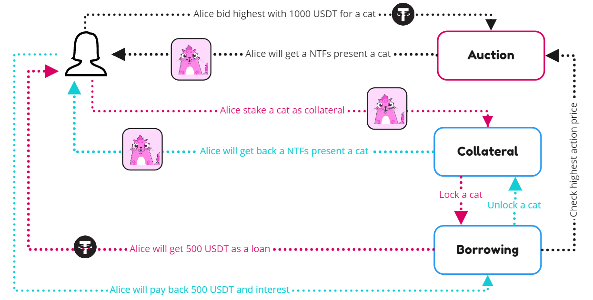
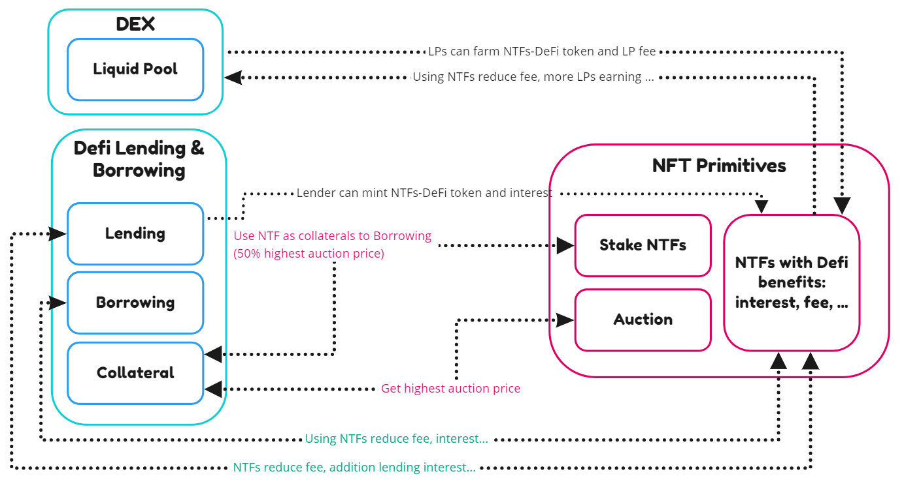

## NTFs X DEFI 

### Using NTFs as collateral in Defi 

The special of ZenChain is full support cross-chain NTFs and Defi. ZenChain allow NTFs owners get more powerful with their NTFs, is just not collectible, user can stake their NTFs as collateral in lending &amp; borrowing application, and can borrow some fungible token (ERC20, BEP20, TRC20 …) to using another defi strategy.

The price of NTFs is determined by the Auction system. That means just users and NTFs which using the ZenChain auction system can use their NTFs as collateral.

ZenChain allows users to borrow up to 50% the highest auction price.

_(Use case with using NTFs as collateral to borrow money)_

### Using Defi to mint NTF-Fi 

NTF-Fi is a non-fungible token with defi traits and be minted by providing liquid to DEX or Lending systems. Imaging this is pear or level up items in traditional games, with the NTFs your power in Defi will be upgraded and make you have some special benefit than others that don&#039;t have any NTF-Fi. Or another word, you can imagine NTF-Fi like a loyalty card or coupon.

Here is some NTF-Fi will be mint with ZenChain:

*   **Fee master:** if a user uses or holds these NTFs when using Defi, users can use DEX and another defi with fee benefit. Each Fee master type NTF has special traits: percent decrease fee, time to use, period, the scope of token …
*   **Interest King:** if a user uses or holds these NTFs when using Defi, users can earn more LP fee in Dex (normal is 0.03%), or users can earn more lending interest, or reduce borrow interest. Each Interest King token has special traits: percent increase or decrease fee, time to use, period, scope of token …
*   **Lucky Pass:** if a user uses or holds these NTFs when using Defi, users can have change to mint more NTF-Fi token … To be fair, ZenChain has Random Number Generator power by Oracle module.

_(Overview NFT and Defi connecting)_